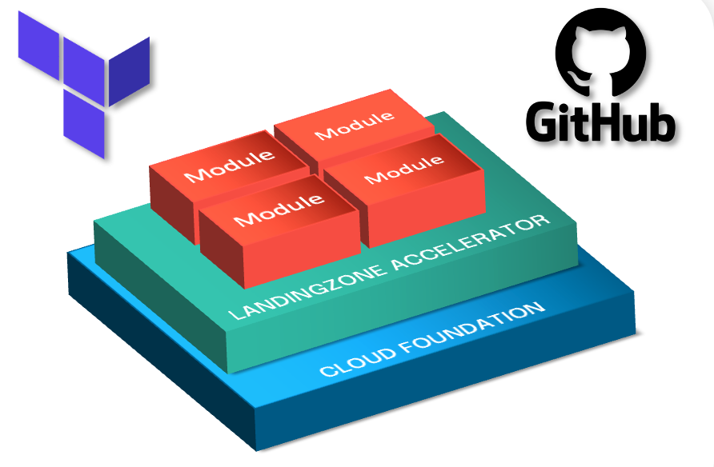

## Value Proposition

Well-Architected Modules (WAM) is an initiative to establish and standardize best practices for Infrastructure-as-Code (IaC) modules. These modules adhere to defined standards, ensuring quality and consistency across Terraform implementations. Once aligned, they are classified as WAMs and made available through their respective registries.

WAM serves as a unified code base and toolkit for Customers, Partners, and CloudNation. It is a community-driven effort, fostering collaboration both within and outside CloudNation.

By codifying Microsoft’s Well-Architected Framework (WAF) and incorporating best practices, WAM accelerates the development and delivery of cloud-native or migrated applications and their supporting infrastructure.

## What are Well Architected Modules?

Well Architected Modules (WAM) represent CloudNation's unified approach to defining and delivering high-quality Infrastructure as Code (IaC) modules. Our goal is to establish a single, consistent standard for creating, consuming, and maintaining IaC modules that align with best practices and the well-architected framework.

### Key Objectives:
- Define how modules should be constructed and built.
- Enforce consistency and testing wherever possible.
- Simplify module consumption for users.
- Deliver reliable resources and configurations for consumers.
- Align modules across public cloud platforms (e.g., Azure, Databricks).

Our mission is to provide a comprehensive library of Well Architected Modules across multiple IaC (Terraform) repositories. These modules, supported by CloudNation, will accelerate Azure resource deployment and architectural patterns, empowering organizations worldwide on their IaC journey.

### Key Features:
- Flexible, generalized, and multi-purpose
- Integrates child and extension resources
- Enhances code quality and ensures a unified user experience

WAM simplifies the development process, enabling teams to deliver robust solutions efficiently.

## Module types

CloudNation distinguishes two types of modules: **Resource Modules** and **Pattern Modules**.

### Resource Modules 
***Purpose:*** Designed to deploy Azure resources and their extensions consistently.

***Characteristics:***
Include resources that share the same lifecycle.
Combine parent resources with their child resources (e.g., Key Vault with secrets, keys, certificates; Storage Account with containers, blobs, files).
Create a logical structure by combining resources that are interdependent.

***Availability:*** Publicly available and open source, allowing for community collaboration and use.

### Pattern Modules
***Purpose:*** Serve as extended solutions and combinations of Resource Modules.

***Characteristics:***
Primarily utilize Resource Modules but can also include other types of resources such as Docker files, null resources, PowerShell scripts, etc.
Often contain business logic and are considered intellectual property.

***Availability:*** Private, as they may contain proprietary business logic and are considered part of the organization's intellectual property.

These modules are designed to deploy Azure resources, their extensions, and reusable architectural patterns consistently. 
They act as composable building blocks that encapsulate groups of resources dedicated to specific tasks.

When talking about Well-Architected-Modules or modules we refer to the **resource modules** from here onwards. 

## Summary of "Well Architected" Principles

- Modules are supported by CloudNation and its internal organization [See here](module_support.html).
- Modules adhere to clear specifications ensuring consistency across all WAM modules (see "Specifications & Definitions").
- Modules are kept up-to-date by the CloudNation core WAM team (owners) and community contributors.
- Modules usually align with Well-Architected Framework (WAF) recommendations unless documented otherwise (e.g. cost saving purposes) [See here](faq.html).
- Modules provide comprehensive documentation (such as README files) and clearly defined input variables, output values, and their types for ease of use.
- Modules contain practical tested examples to ensure users can easily consume and use them out of the box.
- Modules are rigorously tested to ensure compliance with WAM specifications and proper functionality.

## Why Do We Need Well Architected Modules?

The creation of Well Architected Modules addresses the challenges posed by the diverse and fragmented approaches to IaC module development across sectors. Existing efforts often lack consistency in code styling, consumption methods, testing frameworks, and support statements, leading to confusion and inefficiencies for customers and partners.

By establishing a unified strategy and definition for IaC modules, we can:
- Accelerate current and future projects, such as Application Landing Zone Accelerators (LZAs).
- Provide a trusted, consistent, and supported library of modules in multiple languages.
- Enable faster adoption and deployment for consumers at any stage of their IaC journey.

This initiative will reduce confusion and frustration, fostering a collaborative community to create more Well Architected Modules.

## How Will We Create, Support, and Enforce Well Architected Modules?

The WAM Core Team will drive the creation, support, and enforcement of Well Architected Modules by implementing the following:

- Publishing WAM modules to public registries for consumption (e.g., HashiCorp Terraform Registry for Terraform modules).
- Creating and maintaining Well Architected Modules specifications, including IaC language-specific guidelines (currently focused on Terraform).
- Providing clear contribution and publishing guidance for each IaC language.
- Enforcing compliance with WAM specifications through unit, integration, and end-to-end deployment tests.
- Offering long-term support for WAM modules, regardless of ownership status.
- Backing all efforts with the WAM Core Team of CloudNation.




